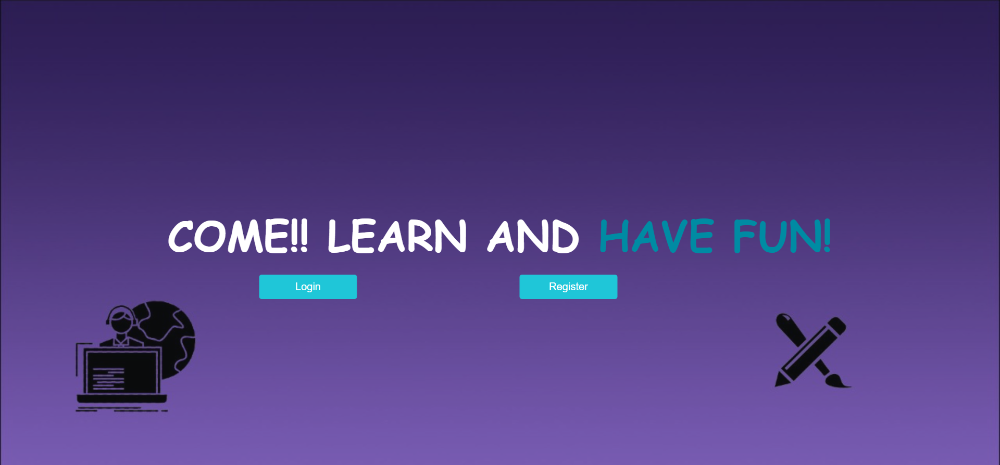
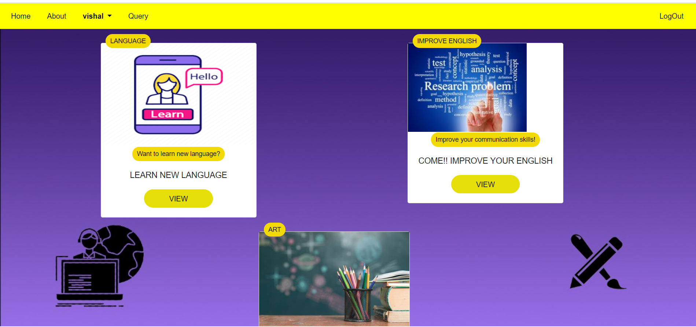
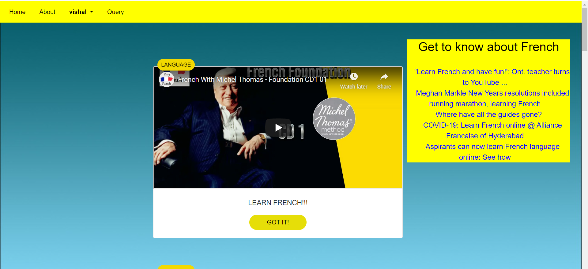
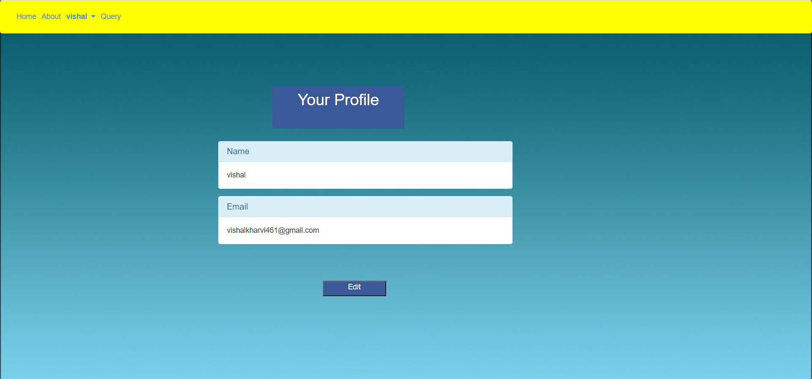

# SCL-Maxo
Digital Education Web App

## Table of contents
* [General info](#general-info)
* [Screenshots](#screenshots)
* [Setup](#setup)
* [Inspiration](#inspiration)
* [Contact](#contact)

## General info
In the view of New Education Policy which aims at overall development of a student, our Digital Education Web app(Bodhak) provides resources to the students(of age group 13-16) in the fields like Languages and Art. The project aims at developing multilingual and artistic skills in the students. It also includes a query box which helps student to clarify their doubts.

## Screenshots





## Setup
Change directory:
```
cd path
```
Install flask and pymysql
```
pip install flask
pip install PyMySQL
pip install GoogleNews
```
Run code
```
flask run
```

## Contact
 achintyasushiksha@gmail.com

